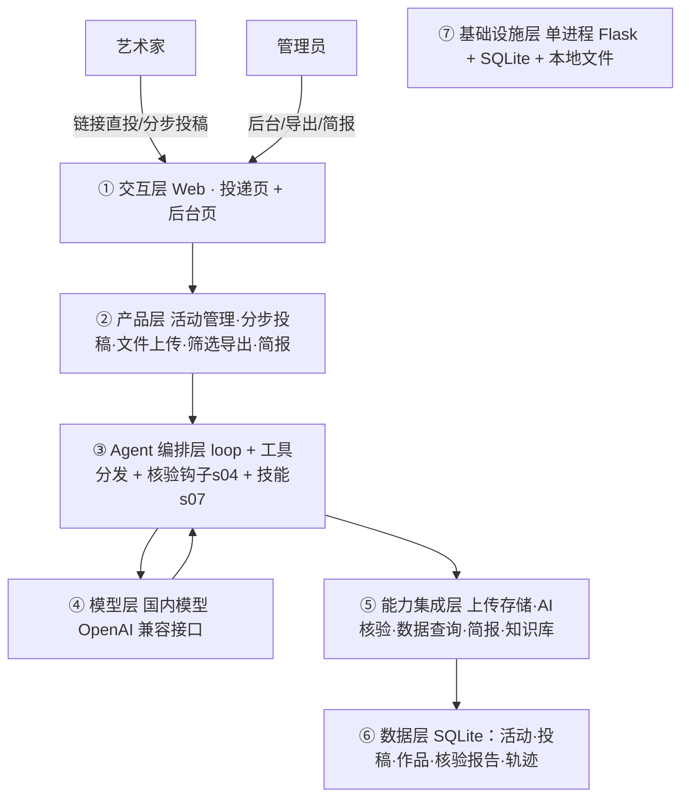

# PRD 推导方案 ——「高校艺术赛事投稿助手」（已定稿）

> 状态：需求已确认，进入 Step 5 代码生成
> 需求来源：面向高校画展 / 毕业展 / 艺术赛事的一站式征集平台（链接直投 + 后台管理 + AI）

---

## 产品定位（一句话）

主办方创建征集活动并生成**投递链接** → 艺术家（作者）通过链接**分步投稿**（个人简历 + 联系方式 + 作品资料）→ 系统 **AI 检查材料完整性与格式** → 后台**查看/筛选/按分类批量导出** → **AI 查询投稿数据、生成工作简报**。

---

## 已确认需求（来自 8 问）

| # | 问题 | 结论 |
|---|---|---|
| 1 | 材料与格式 | 纯艺/设计类原创，类别/题材/风格/数量不限；材料=**个人简历 + 作品资料 + 联系方式**；作品资料=照片（附作品名、尺寸、画种、毕业院校、价格） |
| 2 | 补件功能 | **取消**（AI 只出核验报告，不发补件通知） |
| 3 | 分步投稿 | 4 步：①个人资料 ②上传简历 ③作品资料（可多件）④确认提交 |
| 4 | 进入方式 | **链接直投**，无注册登录 |
| 5 | 模型 | **国内模型**（OpenAI 兼容接口，可配 DeepSeek/Qwen/GLM） |
| 6 | 简报 | 仅后台可见；含艺术家信息、学校分布、作品数量、作品种类 |
| 7 | 页面 | 只做**投递页 + 后台页**；后台所有数据可按不同分类批量导出 |
| 8 | 角色 | 仅作者 + 管理员两方，无评委/初审 |

**剩余默认假设**（未另说明即按此实现，可随时改）：联系方式字段=姓名/电话/邮箱/微信；后台用管理员密钥保护；导出用 CSV；简报为后台内文字报告。

---

## Step 1 · 需求拆解

| 维度 | 结论 |
|---|---|
| 目标 | 用 AI 替代征集中的重复劳动：材料核验、数据查询、工作简报 |
| 用户 | ①管理员（建活动、后台、导出、简报）②艺术家（链接直投） |
| 核心闭环 | 建活动生链接 → 作者分步投稿 → AI 核验 → 后台筛选/导出 → AI 查数/简报 |
| 交付物 | 征集活动 + 投稿作品库 + 核验报告 + 导出表 + 工作简报 |
| 边界 | 原件只读不删；后台需密钥；作者只看自己投稿（链接直投天然隔离） |
| 约束 | 国内模型；100–300 件规模量级 |

## Step 2 · 领域建模（Harness 五要素）

| 要素 | 内容 |
|---|---|
| 工具 | `check_submission`（AI 核验完整性+格式）、`run_sql`（只读查库）、`campaign_overview`（统计总览）、`list_works`（筛选） |
| 知识 | ①征集规则（材料清单/图片格式/大小）②简报模板（四栏目）③数据库 schema |
| 观察 | 核验报告、查询结果、简报内容、各步耗时 |
| 行动 | 输出核验报告、数据统计、工作简报（落库为记录） |
| 权限 | 后台用管理员密钥；投递链接直投、无账号 |

## Step 3 · 组件选型（最少化）

| 组件 | 选否 | 理由 |
|---|---|---|
| s01 Loop | ✅ | Agent 查数/简报基础 |
| s02 工具系统 | ✅ | check/run_sql/overview/list_works |
| s04 钩子 | ✅ | 投稿提交后自动触发核验 |
| s07 技能 | ✅ | 征集规则 + 简报模板 + schema |
| s15 集成 Harness | ✅ | 归一循环 |
| s03 权限 | ⏸ 简化 | 无账号体系，仅「后台管理员密钥」，不引入完整审批管道 |
| s11 后台任务 | ⏸ 二期 | 批量核验/离线简报再上 |
| 其余 | ❌ | 无定时/团队/目标闭环/子Agent |

## Step 4 · 架构

### 7 层 + 数据流



**数据流**：管理员建活动生链接 → 作者分步投稿（表单+文件上传落库）→ 提交触发 s04 核验钩子 → `check_submission` 产出报告（回显给作者）→ 后台 `run_sql`/`campaign_overview`/`list_works` 查数筛选导出 → 生成简报。

### 数据模型

```
campaigns:  id, title, description, deadline, image_formats, max_image_mb, link_token
applicants: id, campaign_id, name, phone, email, wechat, resume_path, status, created_at
works:      id, applicant_id, title, dimensions, medium(画种), school(毕业院校), price, image_path
check_reports: id, applicant_id, missing, format_issues, notes, created_at
```

### 工具清单

| 工具 | 输入 | 输出 | 权限 | 归属 |
|---|---|---|---|---|
| `check_submission` | 投稿+作品+规则 | 核验报告（缺项/格式问题/说明） | allow | ⑤ |
| `run_sql` | SELECT 语句 | 查询结果（≤200 行） | allow（只读） | ⑤ |
| `campaign_overview` | 活动 ID | 投稿数/作品数/学校分布/画种分布/艺术家名单 | allow | ⑤ |
| `list_works` | 活动 ID + 筛选 | 作品明细 | allow | ⑤ |

### 安全边界与降级

- 原件只读；上传白名单（扩展名+大小限制）+ 文件名清洗
- 后台管理员密钥保护；投递链接直投、无账号
- `run_sql` 仅允许 SELECT/WITH，防写库
- 核验降级：图片无法解析标「照片无法解析」，不误判缺失
- 模型降级：查数/简报失败回退到确定性统计表

## 下一步（进行中）

进入 Step 5，产出：`art_exhibition/` 应用（`app.py` Web + `agent.py` 国内模型 Agent + `db.py` SQLite + `checks.py` 核验 + 投递/后台两页模板 + README/种子数据）。
